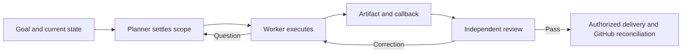

# Delivery orchestration and Interchange

Two skills work together: **delivery-orchestrator** turns accepted specifications into a dependency-aware plan, GitHub work, safe parallel assignments and independent acceptance. **Interchange** carries those assignments across Codex, Claude and external providers, verifies startup/returns and preserves portable session evidence. Governance retains principles and authorization; neither skill grants merge or deployment permission.

Start with [delivery-orchestrator](skills/delivery-orchestrator/SKILL.md). Its [workflow](skills/delivery-orchestrator/references/workflow.md), [visual maps](skills/delivery-orchestrator/references/diagrams.md) and [mandatory scheduling receipt](skills/delivery-orchestrator/references/scheduling.md) explain what runs next and why. Existing approved work resumes from its checkpoint, without repeating discovery.

# Agent Skills

Reusable skills for planning and executing delivery across Codex, Claude Code and external workers such as OpenCode.

## What the two skills deliver

You work with one **Planner** in your coordinating conversation. The Planner turns your goal into bounded assignments, sends them to suitable workers, receives their results, arranges independent review and reconciles delivery. You should not need to copy prompts and handovers between sessions when a supported callback route is configured.

For a coding assignment, the output is a reviewable PR with acceptance evidence and an explicit next action. For an investigation, it is an evidence-backed finding or recommendation. For ongoing projects, it is a reconciled plan and next work that preserve existing changes and decisions.

Together, Delivery Orchestrator and Interchange provide:

- **Clear scope:** outcomes, contracts, ownership, dependencies and proof before implementation; questions go back to the Planner when a material decision is missing.
- **Appropriate agents:** economical builders for settled work, independent reviewers, and specialist escalation when justified. Models and effort are editable preferences, not hardcoded vendor rules.
- **Progress accountability:** full parent/child scheduling, recovery after repeated unchanged waits, and writing reservations separate from acceptance waits; no fixed worker-count target.
- **Reliable returns:** bounded process execution, retained artifacts and correlated callbacks; queued, received and accepted are separate states.
- **Comparable status:** the same report structure for active agents, timing, changes, blockers, evaluations and next actions across projects.
- **Restartable work:** plans, decisions and handovers indexed for a fresh session, another account or another coordinator client; active ownership must be reconciled before takeover.
- **Outcome-based review:** code quality plus the actual requested result, with UX and seeded journey checks at relevant boundaries.

Use it when delegation or continuity earns its cost. A small self-contained edit can be done directly; it does not need an agent hierarchy or a milestone.

## How a job flows



The worker records its understanding, reports “all clear — work starting” with local time/timezone, and proceeds when its gates are open without waiting for acknowledgement. It asks about material gaps and keeps unrelated bugs in the backlog. The Planner does not spend model turns polling workers. After a result returns, independent acceptance checks the exact artifact or commit. Merge, deployment and publication still require their own applicable authority.

See the [ten detailed workflow maps](skills/delivery-orchestrator/references/diagrams.md) for entry paths, planning, agent selection, questions/resume, callback recovery, verification, correction/closure, parallel work and coordinator transfer.

## Who does what

| Role | Responsibility |
|---|---|
| Planner | Scope, decisions, sequence, dispatch, integration and final disposition |
| Builder | Implementation, mechanical GitHub updates and bounded investigation |
| Senior Builder / Architecture-Security | Approved escalation for difficult engineering or consequential design |
| PR Reviewer | Independent target, quality and evidence assessment |
| UX Designer / Reviewer | Interaction design and periodic visual/journey review |
| Journey Tester | Independent functional acceptance at meaningful integration points |

One writer owns an overlapping surface. Roles do not require separate sessions when no benefit exists, except that an author cannot independently accept their own deliverable. See [roles](skills/delivery-orchestrator/references/roles.md) and the [editable profile](skills/interchange/references/profile.example.json).

## What a status report tells you

Every report uses the same six sections: **outcome; changes since the last report; agents and attempts; blockers and ownership; completed dispatch evaluations; continuation**.

You can identify the project, Planner, worker, reviewer, requested versus observed model, current attempt, prior interactions, elapsed time, last observation and next owner. Unknown or stale information is labelled. Evaluations distinguish quality from execution and external waiting time. GitHub owns live delivery state; reports link to it rather than becoming another backlog.

[Status template](skills/interchange/templates/status-report.md) · [Observability and provenance](skills/delivery-orchestrator/references/observability.md) · [Portable continuation index](skills/interchange/templates/continuation.json)

Unit/integration and simple navigation checks belong to the relevant development dispatch. Broader multi-consumer SDK and milestone journeys are allocated in the plan, reusing valid evidence rather than repeating every test at every checkpoint. Claude testers hand browser credential entry to a bounded Codex helper; that cross-client browser route must be verified before it is claimed usable.

## Start using the workflow

1. Give the coordinating agent the [delivery-orchestrator entrypoint](skills/delivery-orchestrator/SKILL.md) and [Interchange transport](skills/interchange/SKILL.md), the project instructions and your outcome. For existing work, supply the current plan, issues/PRs and handover instead of restarting discovery.
2. Choose the relevant roles/profile and agree on scope and acceptance. Keep merge, runtime and publication authority explicit.
3. Store the plan and assignment in a durable project location. Use isolated worktrees for coding and configure/test the actual return route before relying on automatic wakeup.
4. Pilot one bounded deliverable, including a question/resume and review correction where needed. Adopt installed-skill changes deliberately after the pilot; existing assignments retain their agreed contracts until reconciled.

The skill is portable and does not require a private governance vault. Each project may add constraints through its own instructions. No service or global installation is performed simply by reading these files.

## What is implemented—and what is not

| Capability | Current boundary |
|---|---|
| Planning, roles, reviews, status and continuation | Skill instructions and reusable templates; the Planner maintains records and evaluates results |
| External process runner | One literal command, deadline/output limits, exclusive attempt registration, retained logs and terminal event; not an OS sandbox or reboot service |
| Callback relay | Correlated local outbox and Codex queue adapter, with separate receipt acknowledgement |
| Live callback proof | Claude and OpenCode returned codes to Codex; a separate delayed callback woke an idle live Codex session. OpenCode's direct tool callback failed; its validated final used a deterministic wrapper |
| Claude coordinator | Reviewer-recorded background-task completion wakes for workers launched by that same live Claude session; artifacts and notification transcript retained; exact cross-clock latency unresolved |
| Other wake/recovery modes | Early-start Claude wake, independently launched-worker delivery to Claude, and app-closed/reboot recovery remain untested |
| GitHub reconciliation and attribution | Defined workflow using available GitHub tools; no automatic synchronizer or merge enforcement service |
| Reports and evaluations | On-demand linked records plus a local snapshot board; no live process monitor, model benchmarking service or inferred token/cost accounting |

See [transport](skills/interchange/references/transport.md) for actual commands, failure handling and limitations. Provider exit zero alone is not a completed assignment. Text attribution in a commit or PR is not a cryptographic signature.

## File map

| Where | Open it for |
|---|---|
| [`skills/interchange/SKILL.md`](skills/interchange/SKILL.md) | Agent entrypoint and routing to the relevant detail |
| [`references/workflow.md`](skills/delivery-orchestrator/references/workflow.md) | New work, WIP, maintenance, investigations, incidents and scope triage |
| [`references/diagrams.md`](skills/delivery-orchestrator/references/diagrams.md) | Visual validation of job and decision paths |
| [`references/principles.md`](skills/delivery-orchestrator/references/principles.md) | Smallest sound solution, evidence, clarity and justified roadmap preparation |
| [`references/roles.md`](skills/delivery-orchestrator/references/roles.md) + [`profile.example.json`](skills/interchange/references/profile.example.json) | Responsibility, model/effort selection and escalation |
| [`references/verification.md`](skills/delivery-orchestrator/references/verification.md) | Proportionate tests, independent review, UX and journey evidence |
| [`references/observability.md`](skills/delivery-orchestrator/references/observability.md) | Identity, comparable reports, evaluation, transfer and GitHub provenance |
| [`references/communication.md`](skills/delivery-orchestrator/references/communication.md) + [`templates/messages.md`](skills/interchange/templates/messages.md) | Understand/confirm/ask/answer/resume/return, with questions and answers stored in files |
| [`references/transport.md`](skills/interchange/references/transport.md) | Launching, return routes, timeouts and uncertain delivery |
| [`templates/`](skills/interchange/templates) | Plan, assignment, question, handover, review, status and continuation records |
| [`scripts/run_job.py`](skills/interchange/scripts/run_job.py) + [`relay.py`](skills/interchange/scripts/relay.py) | Deterministic process supervision and callback delivery |
| [`references/adoption.md`](skills/interchange/references/adoption.md) | Pilot, active-assignment continuity and governance alignment |
| [`docs/delivery-responsibilities.md`](docs/delivery-responsibilities.md) | Ownership and cooperation between the two skills |

Start from the two skill entrypoints and the map above. Archived experiment records are not current operating instructions.

## Validate changes

```bash
python3 -m unittest discover -s tests
```

The tests cover existing protocol behavior and the relay/runner. Skill and diagram checks complement them; they do not prove that a provider integration or a product's acceptance journey has run. Preserve the distinction between a documented procedure, a passing test and an observed end-to-end result.

### Local activity page

Interchange can publish a local six-column activity board per repository, shared by linked worktrees and multiple coordinators. It puts current work first, groups retries inside one task, and keeps completed/stopped history collapsed. Optional workflow steps are the task-card source; without them the board groups attempts by job. Select a project or inspect all activity, with issue/parent links and expandable evidence. Run `python3 skills/interchange/scripts/dashboard.py --repo <checkout> --snapshot <continuation.json>` and open the printed file. Updates are explicit snapshots, not live monitoring, and GitHub remains the backlog authority. See [observability](skills/delivery-orchestrator/references/observability.md#repository-dashboard-and-session-access) for the snapshot contract and limits.

Workspace configuration and non-destructive retention inventory are described in [workspace.md](skills/interchange/references/workspace.md). The runner drains excess output by default and keeps a separate final-artifact receipt; receiver routes explicitly distinguish Codex queue, Claude parent harness and manual return.

## Optional portfolio adapter

The [portfolio adapter](adapters/marvinamiranda/README.md) is loaded only when selected by the project's governance. Core skills contain no portfolio workflow dependency.

## Installation identity

Interchange can be installed alone for a human or other coordinator. The paired installation rules below apply when using Delivery Orchestrator with it.

Each client uses its normal installed skill directory. When using the paired workflow, Codex and Claude must resolve both skills to the same approved repository commit; record that SHA and each resolved target in the [installation manifest](templates/installation.json). A shared immutable release directory with client-local links is sufficient. Do not mix a working-tree skill with a released companion and report the pair as installed. Active attempts retain their pinned execution resources until a safe checkpoint. Shared owner policy names the skills; it must not require another client's temporary worktree.

Owner-enabled coordinator acceptance and merge is an optional Delivery Orchestrator session setting. See [the merge checkpoint](skills/delivery-orchestrator/references/coordinator-merge.md) for exact-head independent review, green checks, pending review requests and repository authority.
