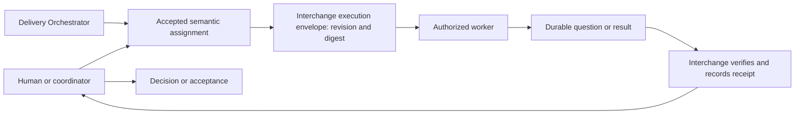

# Delivery responsibilities

Governance owns principles, authorization, delivery-record definitions and evidence requirements. The two skills implement the operating process without granting additional authority.

| Responsibility | Owner |
|---|---|
| Product discovery, specifications, questions and GitHub breakdown | Delivery Orchestrator |
| Dependencies, priority, slice size, role selection and safe parallel scheduling | Delivery Orchestrator |
| Test and review allocation, corrections, acceptance and continuation decisions | Delivery Orchestrator |
| Supported agents, tools, model profiles, commands and session routes | Interchange |
| Execution agreements, dispatch, startup verification, messages and callback receipts | Interchange |
| Execution logs, board publication and communication recovery | Interchange, using Delivery Orchestrator's plan and dispositions |
| Product implementation and evidence | Assigned workers |
| Independent findings and acceptance evidence | Assigned reviewers and testers |

Delivery Orchestrator reassesses all approved unfinished work after each dispatch, return, question, failure, review and unblock, and before yielding. It selects the maximal safe ready set using actual ownership, dependencies and resource constraints. Interchange executes those decisions and returns correlated facts; process exit is not acceptance.

Start with [Delivery Orchestrator](../skills/delivery-orchestrator/SKILL.md) for planning and coordination, or [Interchange](../skills/interchange/SKILL.md) for execution operations. See the [scenario diagrams](../skills/delivery-orchestrator/references/diagrams.md) for the interaction paths. There is one plan and two complementary skills.

GitHub owns live delivery state. The board is a published projection, not a second backlog. Planning approval does not independently authorize implementation, GitHub writes, deployment or publication.

## Assignment and execution layers

Interchange can serve a human or another planner without loading Delivery Orchestrator. When both skills are used, Delivery Orchestrator supplies the semantic assignment and scheduling decision. Manual sessions use reported observations; registered callback verification remains a separate protocol.
