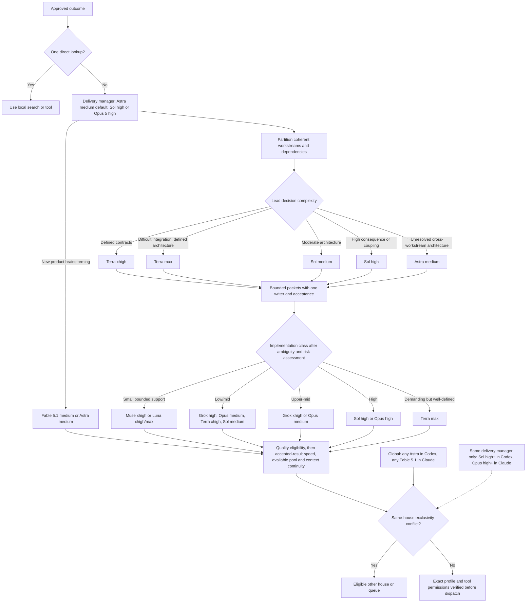
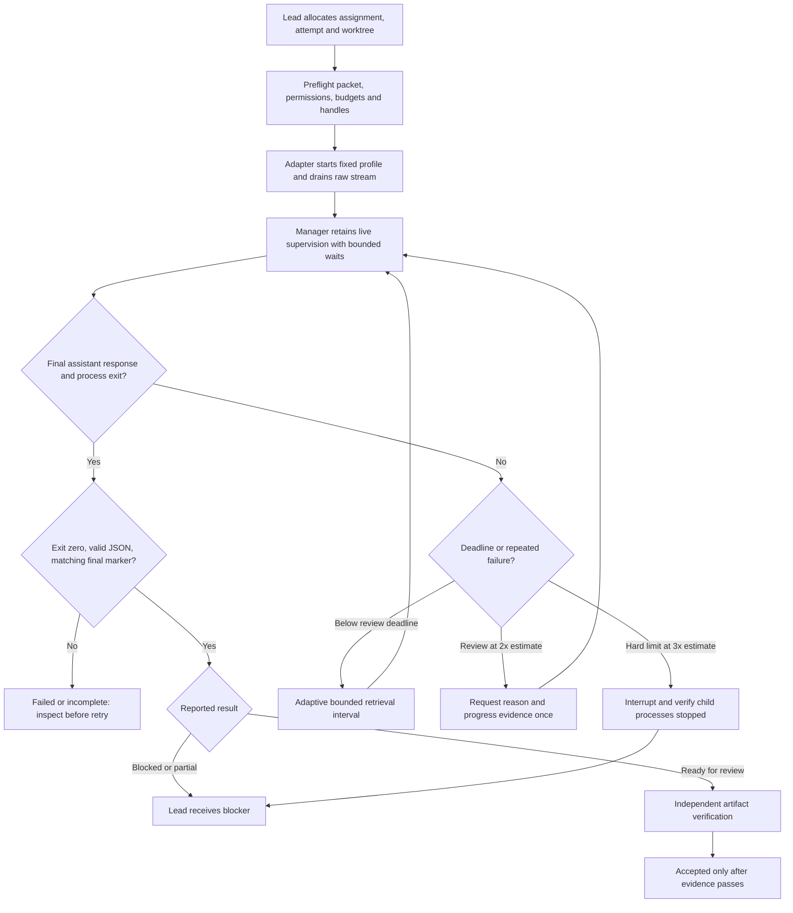
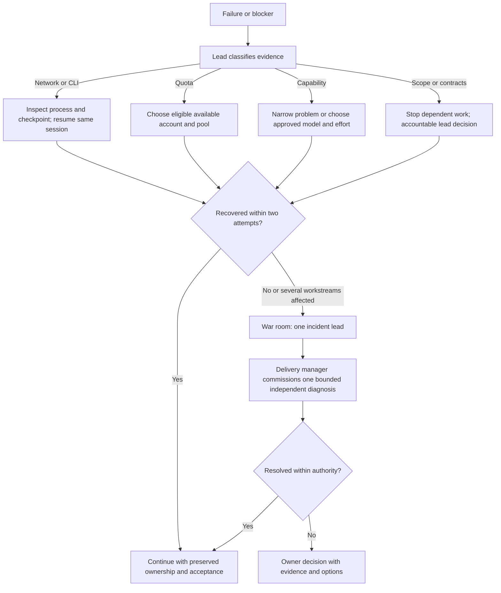
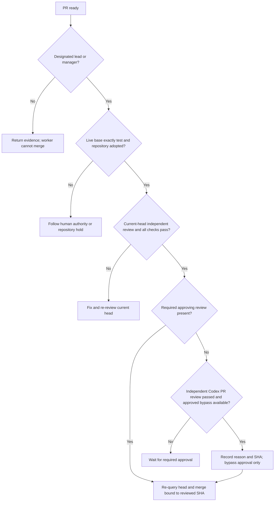
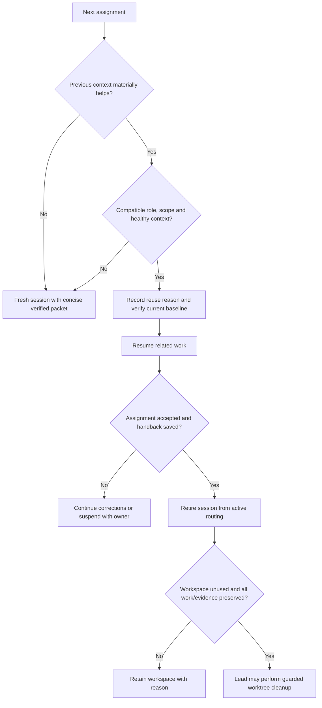
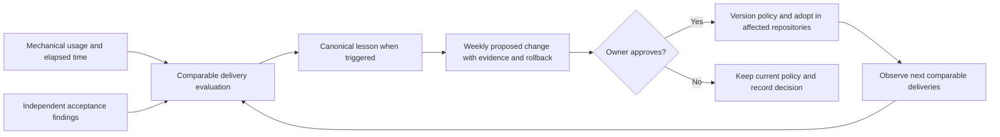

# Interchange decision diagrams

Approved configuration: [policy.json](../skills/interchange/references/policy.json). These diagrams explain its decision paths. Profile assignments are initial hypotheses, not benchmark results. Runtime controls shown here are design requirements; only the completion/scheduling helper is implemented.

## Team and model selection

Pools are starting preferences, not model rankings. Read [development routing instructions](../skills/interchange/references/routing.md) for task boundaries and escalation. Grok uses Grok CLI only; Claude development uses Opus. Worker model choice grants no delegation or merge authority.

Policy 0.4.0 allows Sol high and Opus 5 high as alternative delivery managers, with Astra medium
remaining the default. Product brainstorming uses Fable 5.1 medium or Astra medium.
Any Astra reserves Codex globally and any Fable 5.1 reserves Claude globally.
Sol high-or-higher and Opus high-or-higher reserve their houses only for work
under the same delivery manager. Only medium is currently approved for Fable.
Fable needs confirmed
included-plan eligibility under the no-extra-spending rule.

This revision also requires the manager to retain live supervision while workers
run, machine-owned provider output, fail-closed permission preflight, complete
packet transport, finite watchdogs and verified ownership transfer after abnormal
provider exits. Claude stops after two consecutive no-progress auto-compactions.

## Monitoring and completion

## Recovery and war room

## Merge authority

## Session reuse and retirement

Apply [session lifecycle rules](../skills/interchange/references/session-lifecycle.md). Baseline layers and vertical business slices have different handover boundaries. Neither completion markers nor merges alone authorize cleanup.

## Feedback and changes

