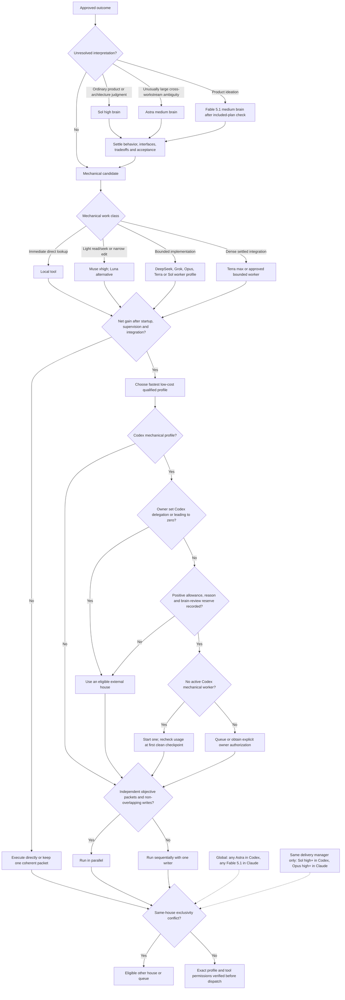
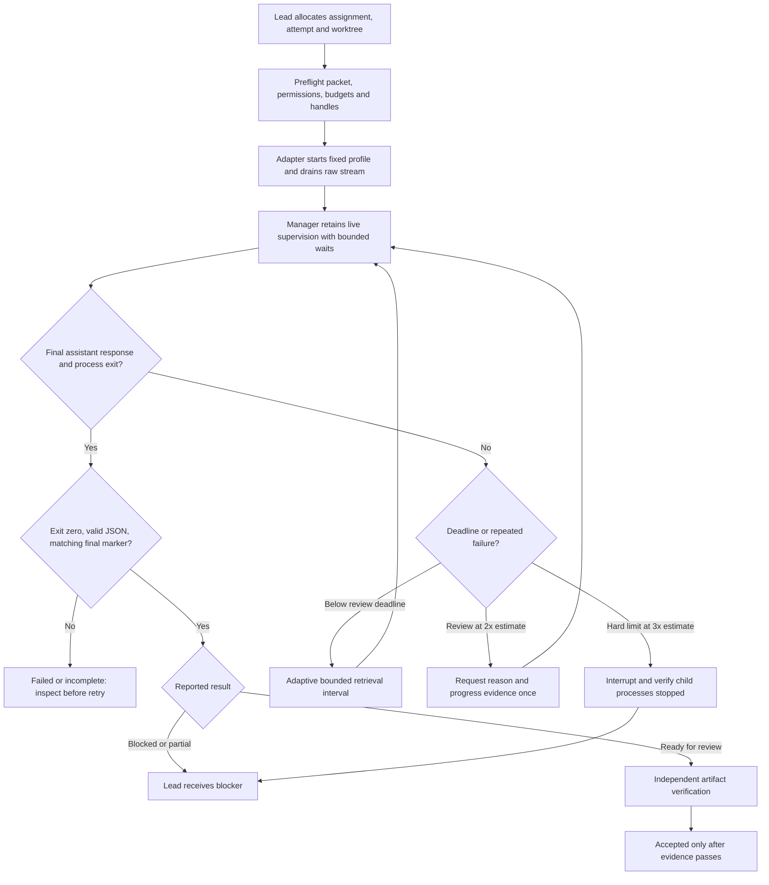
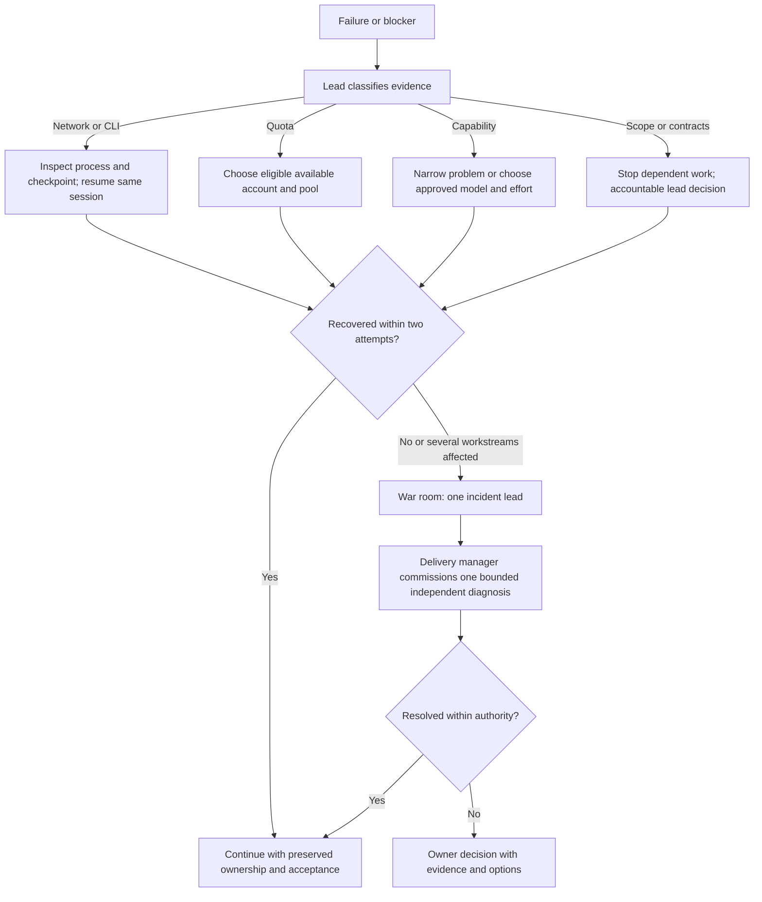
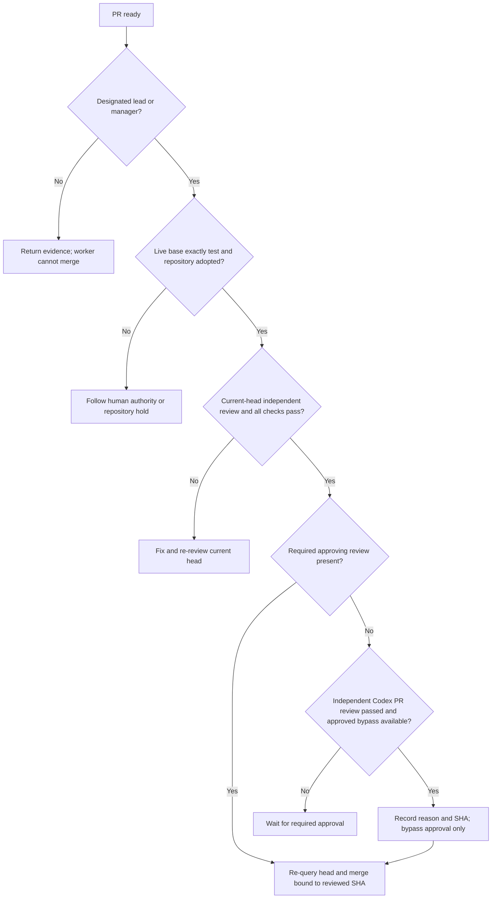
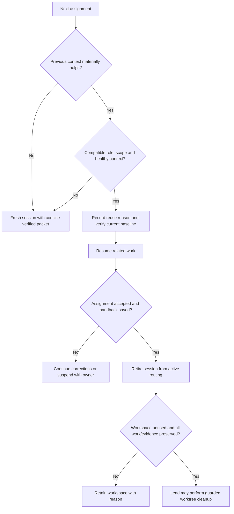
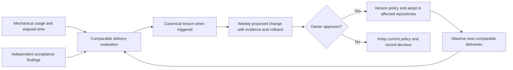

# Interchange decision diagrams

Approved configuration: [policy.json](../skills/interchange/references/policy.json). These diagrams explain its decision paths. Profile assignments are initial hypotheses, not benchmark results. Runtime controls shown here are design requirements; only the completion/scheduling helper is implemented.

## Team and model selection

Sol high is the default product and architecture brain. Astra medium handles unusually large cross-workstream ambiguity; Fable 5.1 medium handles product ideation after its included-plan/no-extra-cost check. Independent semantic and risk acceptance also uses Sol high, with Astra medium for unusually large cross-workstream scope. Other profiles execute settled mechanical packets and return ambiguity instead of interpreting it. A delivery manager on another profile may coordinate but does not gain judgment authority.

Muse Spark 1.3 is the light mechanical and read/seek lane. Use fast, low-cost workers when startup, supervision and integration still produce a net gain, and parallelize only independent objectively testable packets with non-overlapping write ownership. Pools are starting preferences, not universal model rankings. Read [development routing instructions](../skills/interchange/references/routing.md) for task boundaries and escalation. Worker model choice grants no delegation or merge authority.

Codex is protected brain and semantic-review capacity. External houses take mechanical work first. A Codex mechanical worker requires a recorded delivery allowance, exception reason and remaining brain/review reserve; no allowance means zero dispatch. An owner instruction not to use Codex for delegation or leading overrides the allowance and sets worker/lead allocation to zero. Default Codex mechanical concurrency is one, with a usage checkpoint after its first clean checkpoint. Batch brain questions and review meaningful integrated chunks instead of every leaf assignment.

Policy 0.7.0 separates coordination from judgment and protects Codex capacity. Opus 5 high remains an approved
delivery-manager continuity profile but routes interpretation to an approved brain.
Any Astra reserves Codex globally and any Fable 5.1 reserves Claude globally.
Sol high-or-higher and Opus high-or-higher reserve their houses only for work
under the same delivery manager. Only medium is currently approved for Fable.
Fable needs confirmed
included-plan eligibility under the no-extra-spending rule.

This revision also requires the manager to retain live supervision while workers
run, machine-owned provider output, fail-closed permission preflight, complete
packet transport, finite watchdogs and verified ownership transfer after abnormal
provider exits. Claude stops after two consecutive no-progress auto-compactions.

## Monitoring and completion

## Recovery and war room

## Merge authority

PR creation has a separate fail-closed base preflight. Ordinary feature, fix,
chore and documentation packets must target `test`; an ordinary packet
requesting `main` is rejected before the provider API or CLI is called. Only an
explicitly classified human-controlled `hotfix` or `release_promotion` packet
may target `main`, and it must carry `human_only_merge: true` plus full,
matching base/head ref and commit-SHA evidence. The reusable implementation is
`skills/interchange/scripts/pr_base_guard.py`; it is an adapter boundary rather
than remote GitHub enforcement. See [the guard contract](../skills/interchange/references/pr-base-guard.md).

## Session reuse and retirement

Apply [session lifecycle rules](../skills/interchange/references/session-lifecycle.md). Baseline layers and vertical business slices have different handover boundaries. Neither completion markers nor merges alone authorize cleanup.

## Feedback and changes

