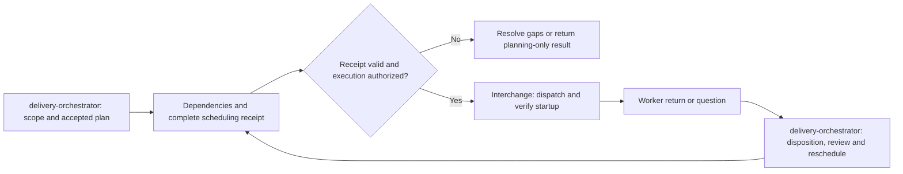

# Delivery orchestrator

Produce a resumable plan and an executable scheduling decision, not a prose promise. The coordinator owns scope and decisions. Planning alone does not authorize implementation, publication or deployment.

## Dependencies and authority

This skill owns the [delivery workflow](references/workflow.md), [scheduling gate](references/scheduling.md), [plan template](templates/plan.md), [GitHub manifest](templates/github-plan.json), and [scheduling receipt](templates/scheduling.json). This skill selects semantic roles and packet requirements; load the installed `interchange` skill for supported transport, execution envelopes, callbacks and execution evidence. If the checker is missing, report the gate unavailable; do not claim validation passed. For discovery, milestone approval, knowledge intake and re-baselining, read [knowledge and discovery](references/knowledge-and-discovery.md) and applicable repository governance. Do not restart discovery for an already approved plan.

Load an adopter adapter only when the project governance explicitly selects it. Resolve its configured installed path; core planning does not require any portfolio adapter. The repository adapter catalogue is documented in the root README.

Use [roles](references/roles.md) for semantic assignment selection and [workflow diagrams](references/diagrams.md) to inspect decision paths.

Use [communication](references/communication.md) for durable questions/answers and [observability](references/observability.md) for status, evaluation, board publication and takeover. The board consumes Interchange execution evidence; it does not replace GitHub.

## Decision ownership

Own product context, specification detail, dependencies, priority, slice size and difficulty. Use Interchange’s verified capability inventory to choose authorized mechanic/coder, senior, reviewer, UX, tester and architecture/security assignments. Resolve avoidable ambiguity in issues and packets so ordinary implementation does not require senior judgment; do not disguise genuine risk or invent detail merely to avoid escalation. Interchange logs execution and keeps the board projection current; only this skill decides what should run and whether its outcome is accepted.

### Supervisor technical decisions

The supervisor decides and executes technical choices within authorized delivery that preserve accepted product behavior and scope. This includes implementation structure, file ownership, safe parallel decomposition, source sequencing, stacked branches, integration order and proportionate verification. A worker brings unresolved engineering questions to the supervisor; the supervisor resolves them without forwarding routine choices to the owner.

Choose the option best supported by evidence for the product's correctness, security, maintainability and accepted outcomes. When no material advantage is clear, choose the fastest sound option to verified delivery: prefer the smallest adequate change and existing mechanisms. Consider total implementation, integration and verification time, not just coding speed. Time-box investigation to what could change that decision; record any material assumption and proceed. Speed never justifies weaker acceptance or hidden risk.

Revise coordinator-owned technical packet details and stale sequencing after verifying dependencies and writer ownership; record the reason and dispatch all safe work. Record the decision, affected packet revision and evidence in the existing delivery record, without creating a separate approval step. Escalate only a new product/scope decision or action outside granted authority, identifying the exact boundary. Explicit owner holds, credentials/data permissions, cost commitments and merge/deployment authority remain binding even when the underlying work is technical; lack of an answer is not consent.

Waiting means an external event with a named owner (for example CI completion or a requested external contract). A technical decision, packet correction or integration task owned by the supervisor is work to perform, not an owner wait. When an external dependency prevents completion, carry out the available preparation and independent work while retaining the actual gate.

## Optional coordinator merge

When the owner enables coordinator acceptance/merge for a session, or an eligible PR is ready to merge, apply [owner-enabled coordinator merge](references/coordinator-merge.md). Record its scope in the continuation. It is off by default and preserves repository target rules and all evidence/operational gates.

## Required checkpoint

1. Establish the approved scope and authority link. Reuse the adopted GitHub or file-based backlog, decisions and handovers. Distinguish approved unfinished work from proposals and future roadmap items; enumerate all in-scope tasks and children, paginating APIs or traversing the document index. Retain the source query/index traversal and retrieval time so completeness can be checked.
2. Resolve requirements that affect implementation before dispatch. Carry known context, contracts, acceptance and non-goals into meaningful PR-sized packets. Routine prerequisite checks belong in those packets; investigate separately only when the answer can change scope/architecture or unblock several jobs.
3. Apply this skill’s scheduling gate to the complete approved set: dependencies, write ownership, runtime/test resources, model authority and actual capacity. Select all safe independent work, record specific exclusions, and identify coordinator actions for unknown readiness. Board display limits never constrain this scan.
4. Save the project-owned plan and scheduling receipt under the project's configured shared coordination root. The adopted backlog owns status; the receipt contains IDs, links and dispatch decisions, not copied issue bodies. Use relative artifact paths, repository identities and a separate machine-root mapping. Include current coordinator identity, handover entrypoint and next wake owner in the continuation record. Another thread, account or client must resolve the same record rather than create a competing plan.
5. Run `python3 <installed-delivery-orchestrator>/scripts/check_schedule.py <receipt>`. Before going idle add `--before-yield`, regardless of the last event trigger. Reuse unchanged evidence for progress-only notifications. Set `--artifact-root` when local evidence lives outside the receipt directory. Preserve command, exit status and receipt identity. Correct failures before declaring the plan dispatch-ready or reporting that no more safe work exists. A passing record checks consistency only: independently verify that its authority, dependencies and resource claims are true.
6. When execution is authorized, hand accepted packets to Interchange, dispatch the selected set and verify startup. For planning-only requests, return the validated plan without launching workers. Before yielding, leave only supervised returns, concrete authority decisions or recorded external blockers; complete executable coordinator actions first.

Use [the semantic assignment](templates/assignment.md) for what the worker must build; bind it to Interchange’s execution envelope rather than duplicating required fields.

For execution, proportional validation, correction and turn-exit decisions, apply [execution checkpoints](references/execution-checkpoints.md), including immediate assignment of missing review/test/acceptance work and board-state reconciliation. For decision authority, risk-surface routing, what a packet must carry, and the independent review/fix loop, read [packets and the review loop](references/packets-and-review-loop.md).

## Resume and change

At takeover refresh current heads, ownership and changed dependency evidence before dispatch. Re-run the scheduling checkpoint after every dispatch/delivery, worker return/question/failure, review disposition, unblock, ownership release or scope change, and before yielding. At material events and before going idle apply the [progress and repeated-wait checkpoint](references/scheduling.md#progress-checkpoint-and-repeated-waits); separate writing reservations from acceptance waits. Reuse unchanged evidence rather than re-reading every document. Record an incomplete source scan as incomplete, never as “nothing else can run.”

## Exit contract

A planning return states: scope coverage, active/dispatched tasks, evidence-backed exclusions, remaining coordinator actions, validation result, and next event/owner. Do not mark planning complete with missing task coverage or unexplained ready-idle work. Failed validation does not cancel safe workers already running.

This is a mandatory skill process gate when routed by AGENTS.md or CLAUDE.md. It is not a client lifecycle hook and cannot itself prevent an agent from ignoring instructions.

## Skill handoff

Delivery orchestrator chooses what runs, dependencies, acceptance checkpoints and next actions. Interchange chooses the authorized execution route, sends the bounded packet, verifies delivery/startup and records the return. Independent reviewers supply proof; the coordinator makes acceptance decisions under existing authority. Neither skill grants merge, deployment or publication permission.
