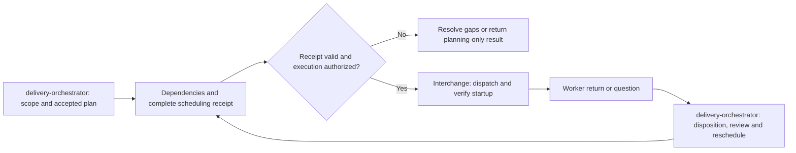

# Delivery orchestrator

Produce a resumable plan and an executable scheduling decision, not a prose promise. The coordinator owns scope and decisions. Planning alone does not authorize implementation, publication or deployment.

## Dependencies and authority

This skill owns the [delivery workflow](references/workflow.md), [scheduling gate](references/scheduling.md), [plan template](templates/plan.md), [GitHub manifest](templates/github-plan.json), and [scheduling receipt](templates/scheduling.json). Load the installed `interchange` skill for worker roles, packets, transport, callbacks and observability. If the checker is missing, report the gate unavailable; do not claim validation passed. For portfolio product discovery and milestone approval, use the applicable `orchestrate-product-delivery` workflow and repository governance. Do not restart discovery for an already approved plan.

## Required checkpoint

1. Establish the approved scope and authority link. Reuse existing GitHub breakdown, decisions and handovers. Distinguish approved unfinished work from proposals and future roadmap items; enumerate all in-scope tasks and children with pagination. Retain the source query and retrieval time so completeness can be checked.
2. Resolve requirements that affect implementation before dispatch. Carry known context, contracts, acceptance and non-goals into meaningful PR-sized packets. Routine prerequisite checks belong in those packets; investigate separately only when the answer can change scope/architecture or unblock several jobs.
3. Apply this skill’s scheduling gate to the complete approved set: dependencies, write ownership, runtime/test resources, model authority and actual capacity. Select all safe independent work, record specific exclusions, and identify coordinator actions for unknown readiness. Board display limits never constrain this scan.
4. Save the project-owned plan and scheduling receipt under the project's configured shared coordination root. GitHub owns backlog/status; the receipt contains IDs, links and dispatch decisions, not copied issue bodies. Use relative artifact paths, repository identities and a separate machine-root mapping. Include current coordinator identity, handover entrypoint and next wake owner in the continuation record. Another thread, account or client must resolve the same record rather than create a competing plan.
5. Run `python3 <installed-delivery-orchestrator>/scripts/check_schedule.py <receipt>`. Preserve command, exit status and receipt identity. Correct failures before declaring the plan dispatch-ready or reporting that no more safe work exists. A passing record checks consistency only: independently verify that its authority, dependencies and resource claims are true.
6. When execution is authorized, hand accepted packets to Interchange, dispatch the selected set and verify startup. For planning-only requests, return the validated plan without launching workers. Before yielding, leave only supervised returns, concrete authority decisions or recorded external blockers; complete executable coordinator actions first.

## Resume and change

At takeover refresh current heads, ownership and changed dependency evidence before dispatch. Re-run the scheduling checkpoint after a worker return/failure, unblock, ownership release or scope change, and before yielding. Reuse unchanged evidence rather than re-reading every document. Record an incomplete source scan as incomplete, never as “nothing else can run.”

## Exit contract

A planning return states: scope coverage, active/dispatched tasks, evidence-backed exclusions, remaining coordinator actions, validation result, and next event/owner. Do not mark planning complete with missing task coverage or unexplained ready-idle work. Failed validation does not cancel safe workers already running.

This is a mandatory skill process gate when routed by AGENTS.md or CLAUDE.md. It is not a client lifecycle hook and cannot itself prevent an agent from ignoring instructions.

## Skill handoff

Delivery orchestrator chooses what runs, dependencies, acceptance checkpoints and next actions. Interchange chooses the authorized execution route, sends the bounded packet, verifies delivery/startup and records the return. Independent reviewers supply proof; the coordinator makes acceptance decisions under existing authority. Neither skill grants merge, deployment or publication permission.
