# Delivery workflow diagrams

Read top to bottom. Diamonds are decisions; labelled arrows are their outcomes. These maps explain the workflow in [workflow.md](workflow.md), role selection in [roles.md](roles.md), checks in [verification.md](verification.md), and delivery in [transport.md](../../interchange/references/transport.md). Those references own the detailed rules. Profile and repository authority determine who may approve an action.

## 1. Choose the job

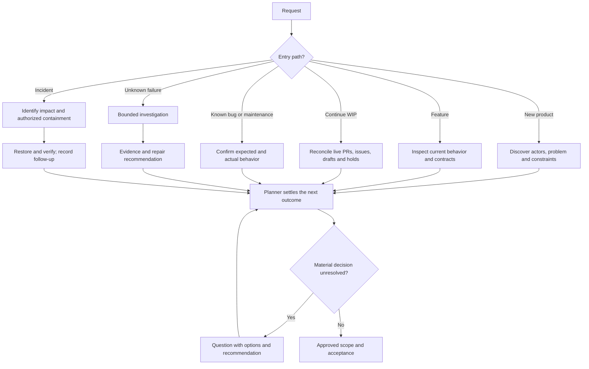

## 2. Plan, size and publish work

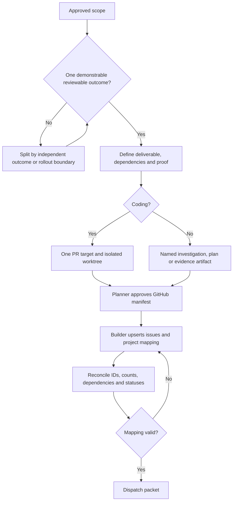

## 3. Select the executor

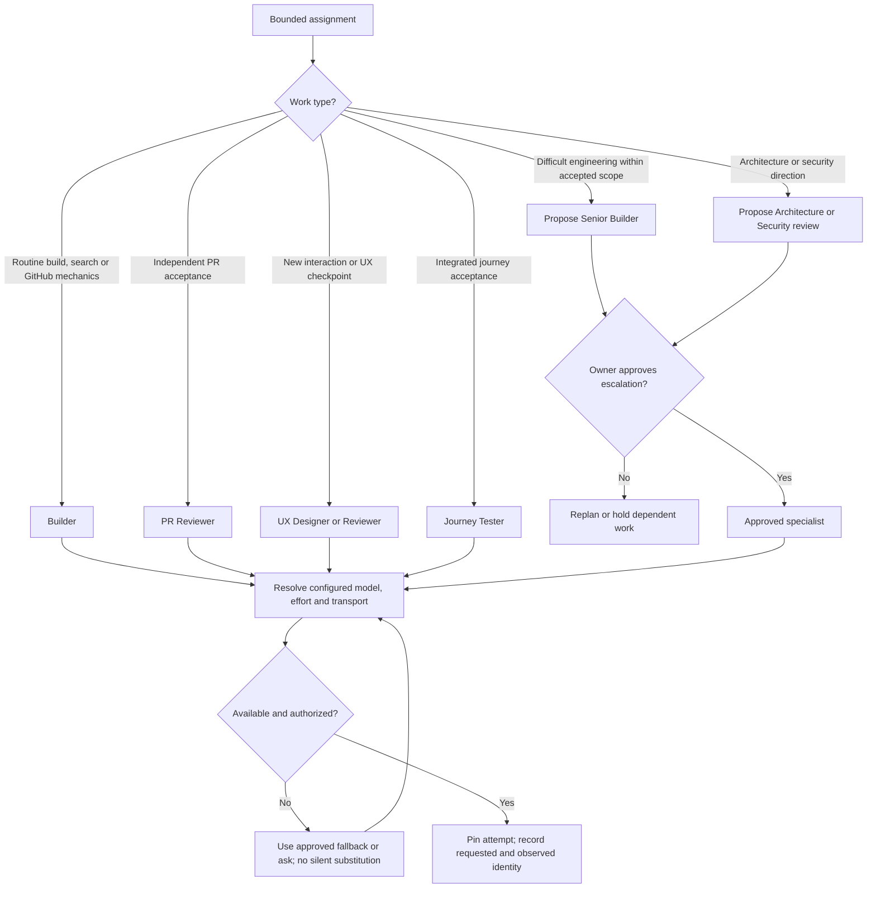

## 4. Start, ask and resume

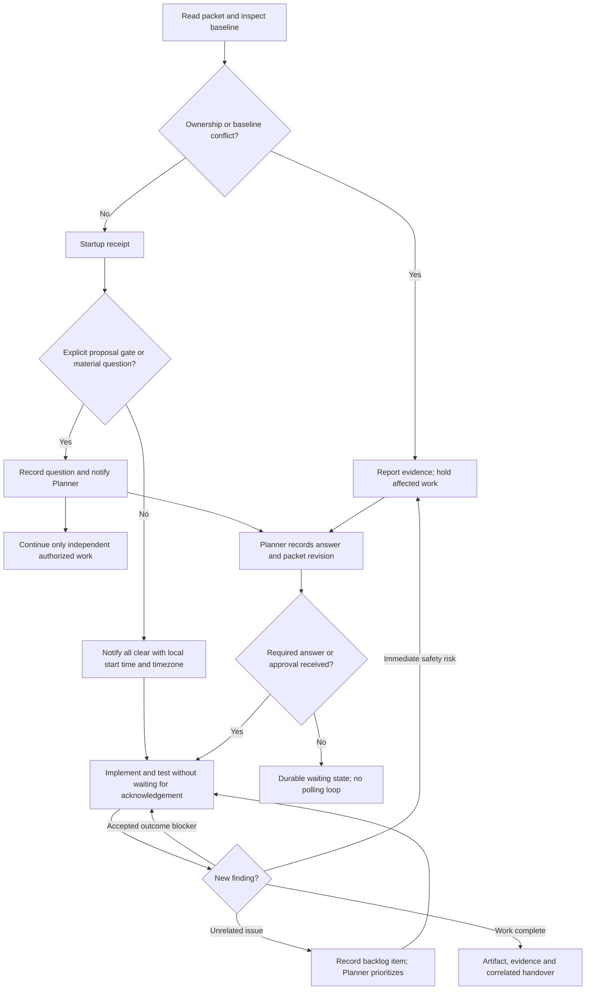

## 5. Dispatch, callback and failure recovery

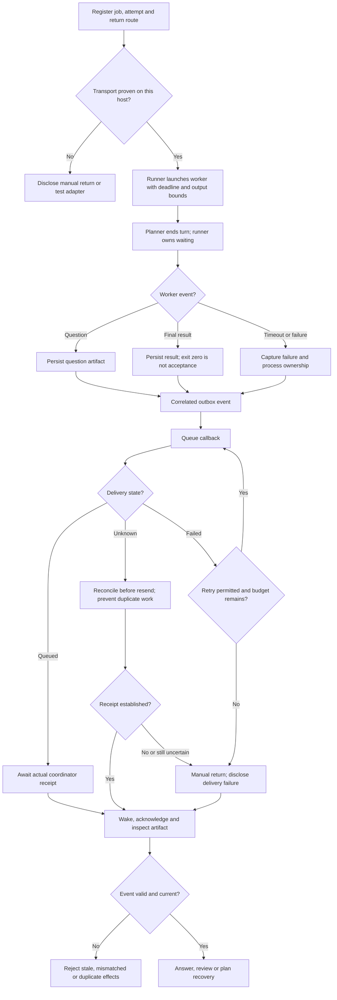

## 6. Choose verification

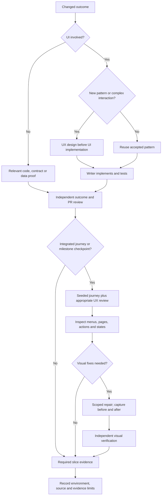

## 7. Review, correct and close

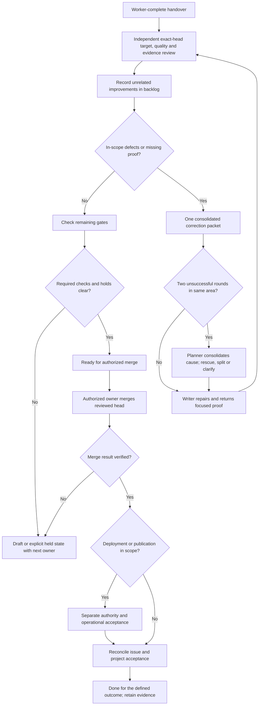

## 8. Parallel work, interruption and adoption

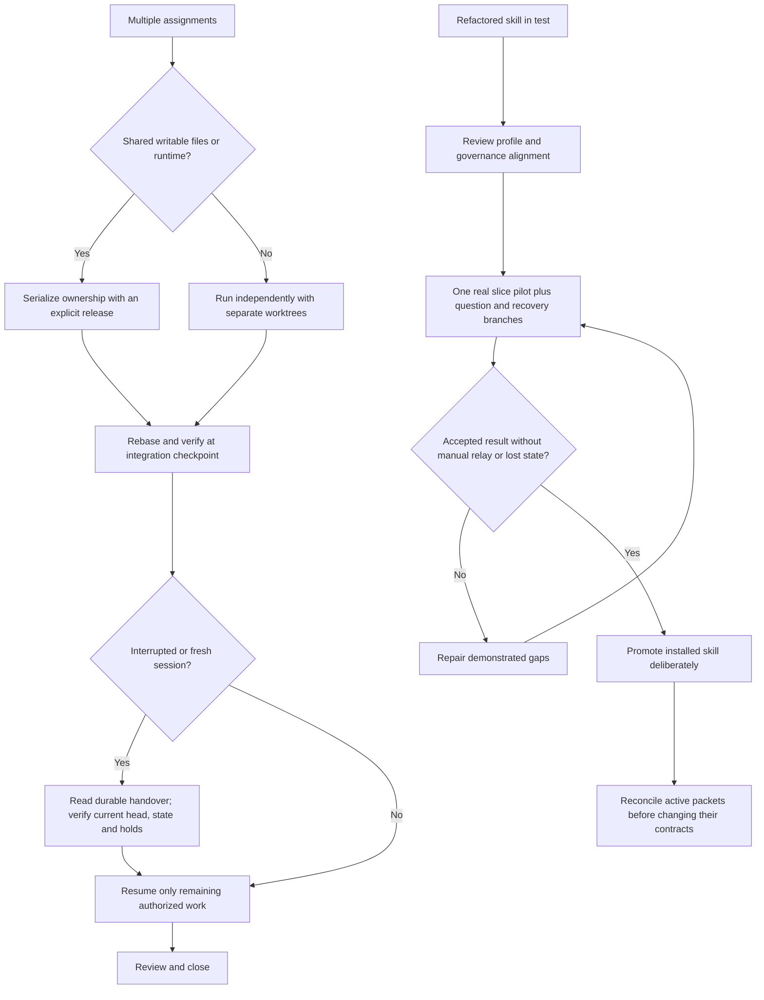

## 9. Observe, evaluate and transfer

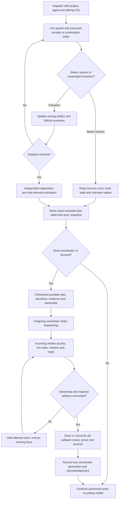

## 10. Claude browser sign-in assistance

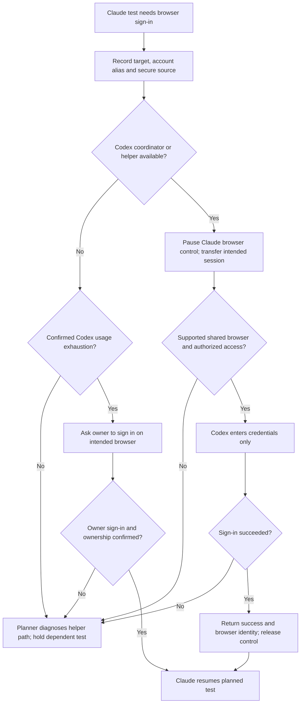

## Walkthrough checklist

Validate at least one path through each diagram before adoption: feature; WIP; known bug; investigation; incident; mechanical GitHub work; role escalation; question/resume; duplicate or uncertain callback; timeout; UX repair; failed review; shared-file handoff; restart; merge with a separate deployment hold. A diagram is explanatory evidence, not proof that a transport or product journey has run successfully.

## Shared workspace and takeover

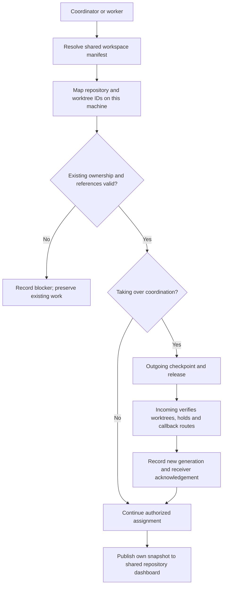

## Retention inventory

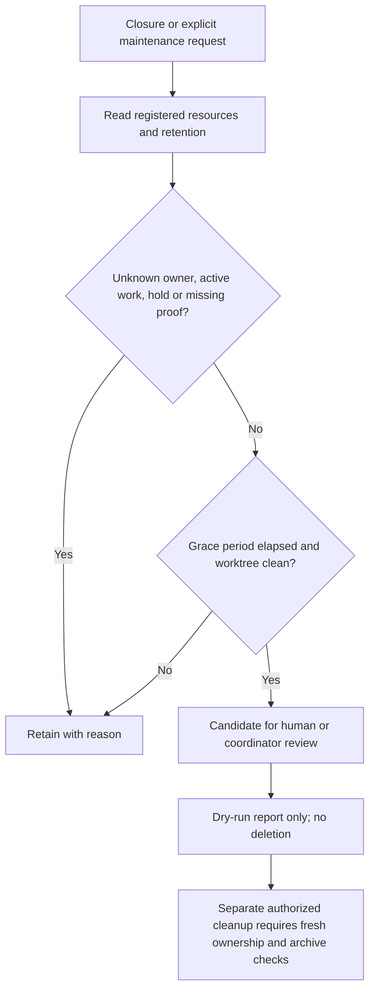

## Scheduling after every return

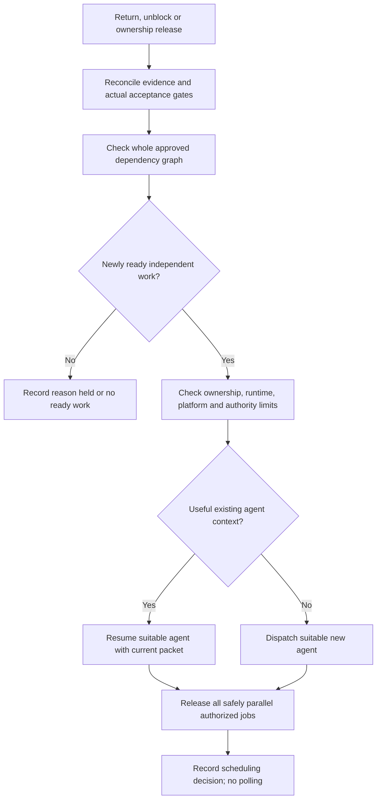
